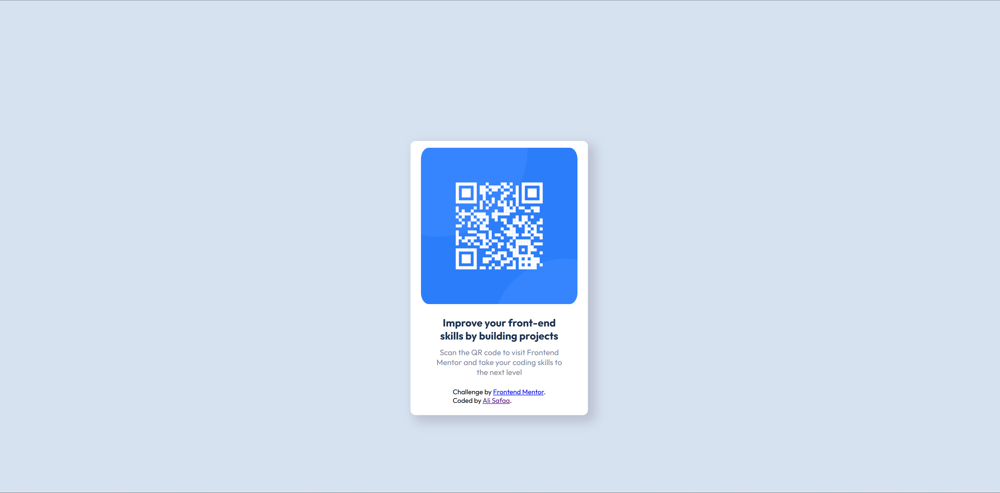

# Frontend Mentor - QR code component solution

This is a solution to the [QR code component challenge on Frontend Mentor](https://www.frontendmentor.io/challenges/qr-code-component-iux_sIO_H). Frontend Mentor challenges help you improve your coding skills by building realistic projects. 

## Table of contents

- [Overview](#overview)
  - [Screenshot](#screenshot)
  - [Links](#links)
- [My process](#my-process)
  - [Built with](#built-with)
  - [Continued development](#continued-development)
  - [Useful resources](#useful-resources)
- [Author](#author)
- [Acknowledgments](#acknowledgments)

## Overview

### Screenshot

### Links

- Solution URL: [Add solution URL here](https://your-solution-url.com)
- Live Site URL: (https://qr-code-component-main-nine-bay.vercel.app/)

## My process

### Built with

- Semantic HTML5 markup
- CSS custom properties

### Continued development

### Useful resources

(https://www.frontendmentor.io/) - This helped me for learning the web developer and design web. I really liked this pattern and will use it going forward.

## Author

- Website - (https://my-portfolio-three-orpin-67.vercel.app/)
- Frontend Mentor - (https://www.frontendmentor.io/profile/ali-safaa)

## Acknowledgments

thanks for the front-end mentor for giving me this opportunity to learn this skills and become web developer